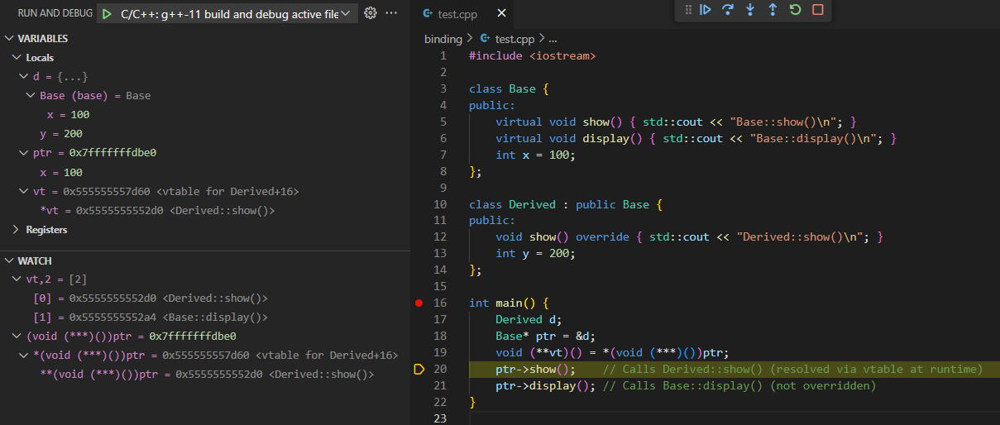
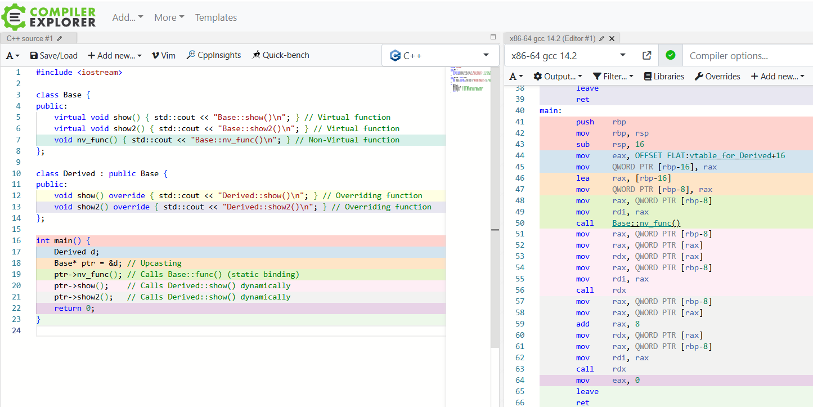
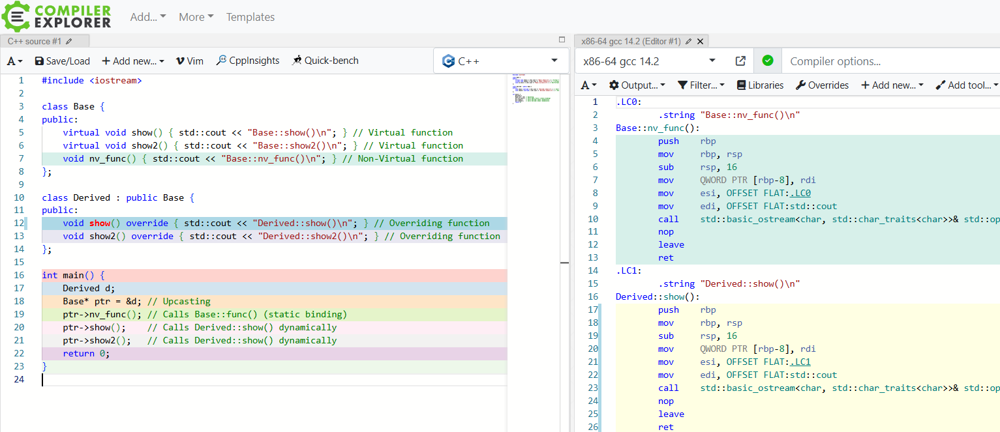

# Contents

1. [Big Picture of Polymorphism](#big-picture-of-polymorphism)
2. [Polymorphism](#polymorphism)
3. [Virtual Functions](#virtual-functions)
4. [Virtual Tables (vtable)](#virtual-table-vtable)
5. [What Happens at Compile-time & Runtime?](#what-happens-at-each-stage)
6. [Summary](#summary)

# Big Picture of Polymorphism 
## Targets
* Polymorphism (Target):
  * Dynamic Binding (Means of polymorphism)
  * vtable (Means of dynamic binding)

Polymorphism is the goal. To accomplish it, the concept of dynamic binding comes into help. Among the implementations of dynamic binding, vtable is one of the most common options adopted.
## Means
* Dynamic Binding (Means):

Dynamic binding is the mechanism that achieves polymorphism. **It ensures that the correct function is called for an object, based on its runtime type rather than its compile-time type**. Dynamic binding is accomplished through the use of virtual functions and vtables.

* vtable (Means):

The vtable (virtual table) is a data structure used to implement dynamic binding. The vtable holds pointers to the virtual functions of a class. When a virtual function is called on an object, **the runtime system looks up the function pointer in the vtable to determine the correct function to execute**.

## Relationships
Polymorphism -> Dynamic Binding -> vtable (virtual functions)

* Polymorphism:

  * Goal: Enable objects of different derived classes to be treated as objects of a common base class, allowing for flexible and reusable code.

* Dynamic Binding:

  * Mechanism: Ensure that the correct virtual function is called based on the runtime type of the object.

  * How: Uses the vtable to achieve runtime function resolution.

* vtable:

  * Implementation: Stores pointers to virtual functions for a class.

  * Purpose: Supports dynamic binding by providing a way to look up the correct function to call at runtime.
  * Common Practices of dynamic binding: [binding/d_binding.cpp](binding/d_binding.cpp)
  * Under the hood of polymorphism function calls: [binding/v_table.cpp](binding/v_table.cpp)

# Polymorphism
* If an instance sends a stimulus to another instance, but does not have to be aware of which class the receiving instance belongs to, we say that we have polymorphism.
* Polymorphism is saying that the behavior of an object in response to an event (function call) is determined by the object itself
* **It allows objects of different classes to be treated as objects of a common base class**
* **Polymorphism enables functions to use objects of different types through a uniform interface (Base), providing flexibility and reusability in code.**
* For every inherited virtual functions, they are not resolved until they are called
* To achieve Polymorphism in C++, one can coordinate virtual functions, and class inheritance, etc.
  * [polymorphism/person.cpp](polymorphism/person.cpp)
  ``` c++
  class Person {
  public:
      // ...
      virtual ~Person() {} // ensure the derived class destructors are called properly.
      // Pure virtual function: Indicates that the derived classes must override this function, otherwise they cannot initiate objects.
      virtual void greeting() = 0; // makes the class abstract and cannot be instantiated.
      // ...
  }; 

  class American : public Person {
  public:
      // ...
      void greeting() override {
          cout << "Nice to meet you! I am " << this->getName() << ". How's going?" << endl;
      }
  };

  class Japanese : public Person {
  public:
      // ...
      void greeting() override {
          cout << "こんにちは" << endl; 
      }
  };

  class Taiwanese : public Person {
  public:
      // ...
      void greeting() override {
          cout << "你好" << endl; 
      }
  };

  int main() {
    Person* american = dynamic_cast<Person*>(new American("John Doe"));
    Person* japanese = dynamic_cast<Person*>(new Japanese("鈴木太郎"));
    Person* taiwanese = dynamic_cast<Person*>(new Taiwanese("陳太明"));
    // For each class, the function print different messages
    american->greeting();  // Output: Nice to meet you! I am John Doe. How's going?
    japanese->greeting();  // Output: こんにちは
    taiwanese->greeting(); // Output: 你好
    // ...
  }
  ```
  * Pointer casting:
  ``` c++
  Derived* derived_ptr = new Derived();
  Base* base_ptr = dynamic_cast<Base*>(derived_ptr);  // upcasting
  ```
  * Manage the interface in a top-down (Base-Derived) manner, so that we can modify the code from Base, which enables minimun modification
  * 'override' keyword: check the derived functions are consistent with the interface in Base class, if not, raise error in compile-time
  ``` c++
  class Base {
  public:
      virtual void func1(const string str) { cout << str << endl; }
      // ...
  };

  class Derived : public Base {
      // Since 'override' is used, this would generate error during compilation, because it is not consistent with Base::func1(const string str)
      // void func1(const char* str) override { cout << "overrided func1 of Derived: " << str << endl; }
      void func1(const string str) override { cout << "overrided func1 of Derived: " << str << endl; }
      // ...
  };
  ```

# Virtual Functions
#### Abstract Class
* At least one pure virtual function delared in class
* Can't be used to initiate objects, can only be the ***interface*** to the derived classes
#### Pure Virtual Function
* Force the derived classes to override the implementation of the pure virtual functions
* **If there are pure functions not overriden, the derived classes will become abstract too**
* Message: For this function, only the interface is inherited. **The implementation is left to be overriden in derived classes.**
#### (Simple/Normal) Virtual Function
* Message: For this function, both the interface and the implementation are inherited, the derived classes can choose to either override it, or not to.
* If not overriden, the function inherited from Base will be called.
#### Non-virtual Function
* Message: Inherit the interface, and **keep the implementation untouched (no overriding)**
* Resolved in compile-time (static binding)
* Overriding them in the derived class does not achieve polymorphic behavior
  * Upon calling the same function with a Derived object and a Base object, the output is the same, i.e., this is not polymorphic behavior.
  * [binding/non_v_func.cpp](binding/non_v_func.cpp)
#### Virtual Destructor
* Non-virtual destructor makes the destructor of the derived class not called, resulting in incomplete destruction.
#### Overriding Virtual Functions
* Given an abstract class: Base, if the pure virtual function is not overriden in derived classes, the derived classes would become abstract, making it cannot be used to instantiate objects (except for virtual destructor, because the compiler generates a default destructor).
* [binding/v_desturctor.cpp](binding/v_desturctor.cpp)
* [binding/not_overriding_vFunc.cpp](binding/not_overriding_vFunc.cpp)
#### Refs:
* [C++中關於 virtual 的兩三事](https://medium.com/theskyisblue/c-中關於-virtual-的兩三事-1b4e2a2dc373)
* [Why a pure virtual destructor needs an implementation](https://stackoverflow.com/questions/21109417/why-a-pure-virtual-destructor-needs-an-implementation)

# Virtual Table (vtable)
* One of the most common methods to achieve polymorphism
* In many C++ implementations, the virtual table pointer is the first `sizeof(void (**)())` bytes (4 or 8) of the object
* When dereferencing the vtable pointer, you get the starting address of the virtual table: `__vptr`
  * `*vtable_ptr` -> `__vptr`
* `__vptr` is a hidden member
  *  An pointer pointing to function pointers (virtual functions)
  *  vtable `__vptr` is an array of function pointers, which is of type `void (*[])()`
     *  Each entry is of type `void (*)()` (function pointer)
     *  So we can do a little trick to access `__vptr`, which is by explicitly convert the obj address to `void (***)()` (a ptr to ptr to function ptrs) manually, then dereference it to get the ptr to function ptrs (array of ptrs).
     ``` cpp
     Derived derivedObj;
     Base* base_ptr = &derivedObj;
     void (**vtable)() = *reinterpret_cast<void (***)()> (&derivedObj);
     vtable[0](); // access the first virtual function
     ```
* Ecah objects has their own vtables, if there is at least one virtual function in the class
  * [binding/v_table.cpp](binding/v_table.cpp)
* Given class Base and Derived:
``` cpp
class Base {
public:
    virtual void show() { std::cout << "Base::show()\n"; }
    virtual void display() { std::cout << "Base::display()\n"; }
    int x = 100;
};

class Derived : public Base {
public:
    void show() override { std::cout << "Derived::show()\n"; }
    int y = 200;
};

int main() {
    Derived d;
    Base* ptr = &d; // ptr stores the address of d, but it can only access members of Base. It does not see any Derived-specific members (unless accessed through a proper cast).
    void (**vt)() = *(void (***)())ptr;
    ptr->show();    // Calls Derived::show() (resolved via vtable at runtime); equivalent to (*vt[0])()
    ptr->display(); // Calls Base::display() (not overridden; resolved via vtable at runtime); equivalent to (*vt[1])()
}
```
* For Base, the `__vptr` can be illustrate as:
``` cpp
struct `__vptr` {
	void (*show)();
	void (*display)();
}
```
* As for Derived, each entry is the "most-derived" version of function:
``` cpp
struct __vptr_ptr {
	show = Derived_show;
	display = Base_display;
}
```
* Watch during debugging

 

* For ptr, it is a Derived obj being viewed as Base
  * It can only access members of Base. It does not see any Derived-specific members (unless accessed through a proper cast).
  * [binding/s_binding.cpp](binding/s_binding.cpp)
* Derived is derived from Base, so `__vptr` can still access the right functions
* Refs:
  * [C++ 內部如何實現多型](https://npes87184.github.io/2019-06-08-how-c++-achieve-polymorphism-internally/)
  * [stack overflow: A helper variable for virtual table in c++](https://stackoverflow.com/questions/18246016/void-vt-void-ptr-a-helper-variable-for-virtual-table-in-c)
  * [Code Project: Displaying vtable when debugging](https://www.codeproject.com/Tips/90875/Displaying-vtable-when-debugging)
  * [Learn C++: 25.6 — The virtual table](https://www.learncpp.com/cpp-tutorial/the-virtual-table/)
  
# What Happens at Each Stage?

```c++
// binding/summary.cpp
class Base {
public:
    virtual void show() { std::cout << "Base::show()\n"; } // Virtual function
    virtual void show2() { std::cout << "Base::show2()\n"; } // Virtual function
    void nv_func() { std::cout << "Base::nv_func()\n"; } // Non-Virtual function
};

class Derived : public Base {
public:
    void show() override { std::cout << "Derived::show()\n"; } // Overriding function
    void show2() override { std::cout << "Derived::show2()\n"; } // Overriding function
};

int main() {
    Derived d;
    Base* ptr = &d; // Upcasting
    ptr->nv_func(); // Calls Base::nv_func() (static binding)
    ptr->show();    // Calls Derived::show() dynamically
    ptr->show2();   // Calls Derived::show() dynamically
    return 0;
}
```

## Dynamic Binding

### 1. Compilation Stage

* Compile the functions for non-virtual/virtual functions
* Creates a vtable for `Base` and `Derived`
  ```cpp
  Base vtable: [ Base::show() Base::show2() ]
  Derived vtable: [ Derived::show() Derived::show2() ]
  ```
* For each object that contains virtual functions, place an hidden pointer `__vptr` (which points to the `vtable`) in the begining of that object memory layout
  
### 2. Runtime Stage

* When `ptr->show();` executes:
  * The program fetches the `__vptr` from `d` (which points to `Derived`'s `vtable`).
  * It looks up the correct function in the `vtable` (`Derived::show()`).
  * Calls `Derived::show()` dynamically via function pointer.
  ```assembly
  mov     rax, QWORD PTR [rbp-8]  # Load ptr (dereference the address of d) into rax 
  mov     rax, QWORD PTR [rax]    # Load __vptr (vtable pointer from d) into rax
  mov     rdx, QWORD PTR [rax]    # # Fetch the function pointer (Derived::show()) from vtable 
  call    rdx                     # Call Derived::show()
  ```

## Static Binding

```assembly
mov     rax, QWORD PTR [rbp-8]   # Load ptr (address of d) into rax
mov     rdi, rax                 # Move ptr (this pointer) into rdi
call    Base::nv_func()             # Direct function call to Base::nv_func()
```

* `call Base::nv_func()`
  * Direct function call (static binding), i.e., jump right to the label `Base::nv_func():`
  * The compiler knows at compile time that `Base::nv_func()` must be called, so no vtable lookup is needed.
  
## Full Example Code

[binding/summary.cpp](binding/summary.cpp)

[binding/summary.asm](binding/summary.asm)
  




# Summary

Before the function jump, dynamic binding calls have to lookup the `vtable`, while static binding calls don't have to, because the compiler, at compile time, already knows `Base::func()` must be called, so no `vtable` lookup is needed.

